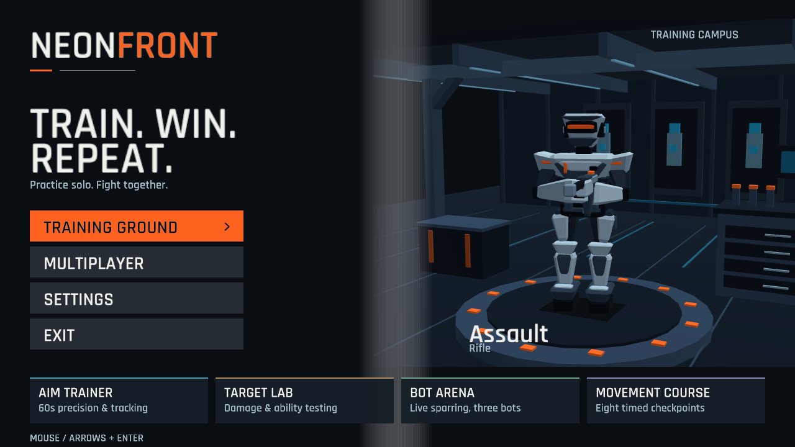
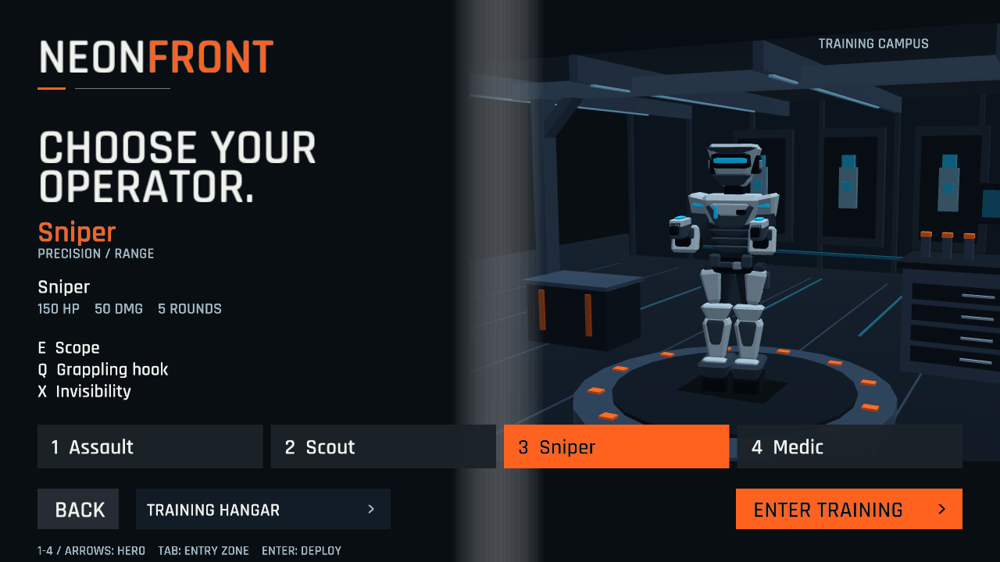
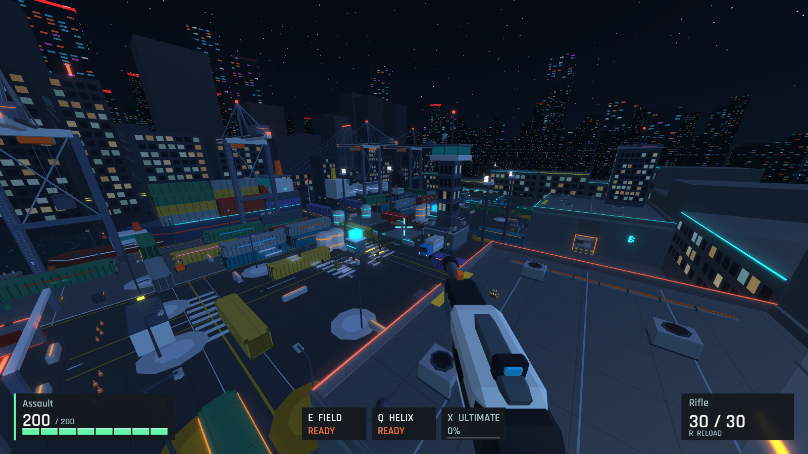
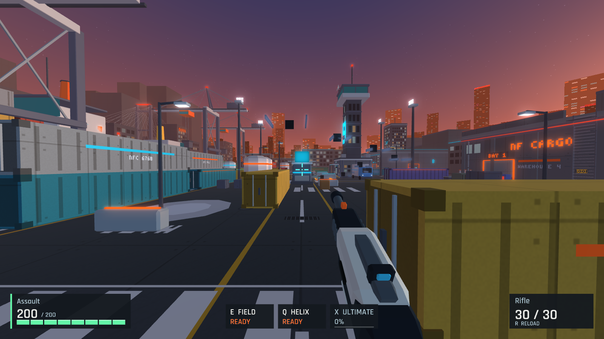
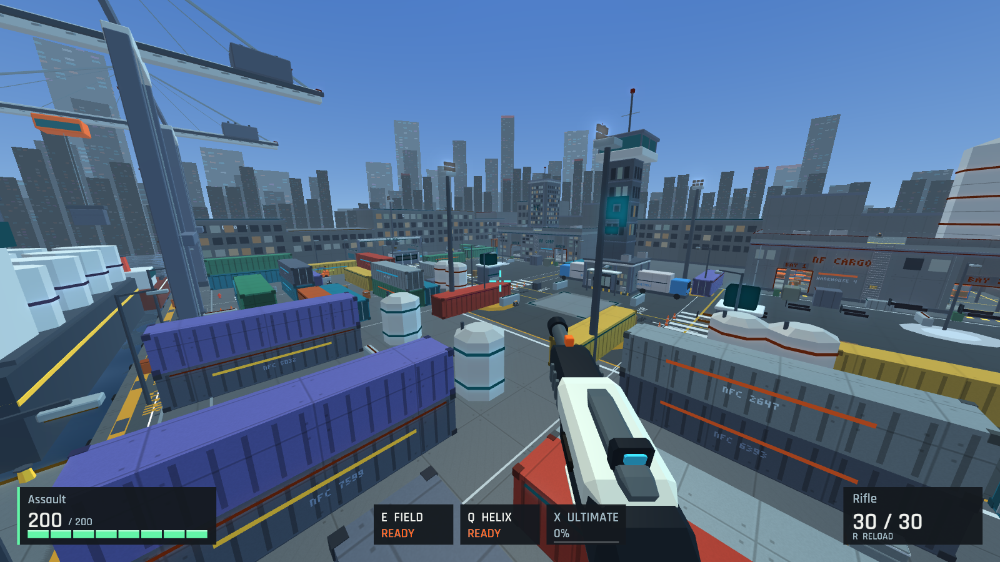
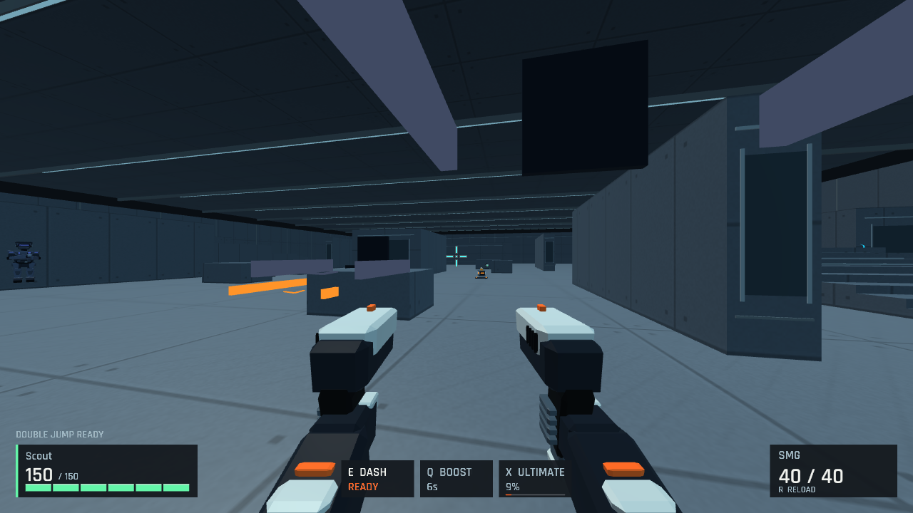
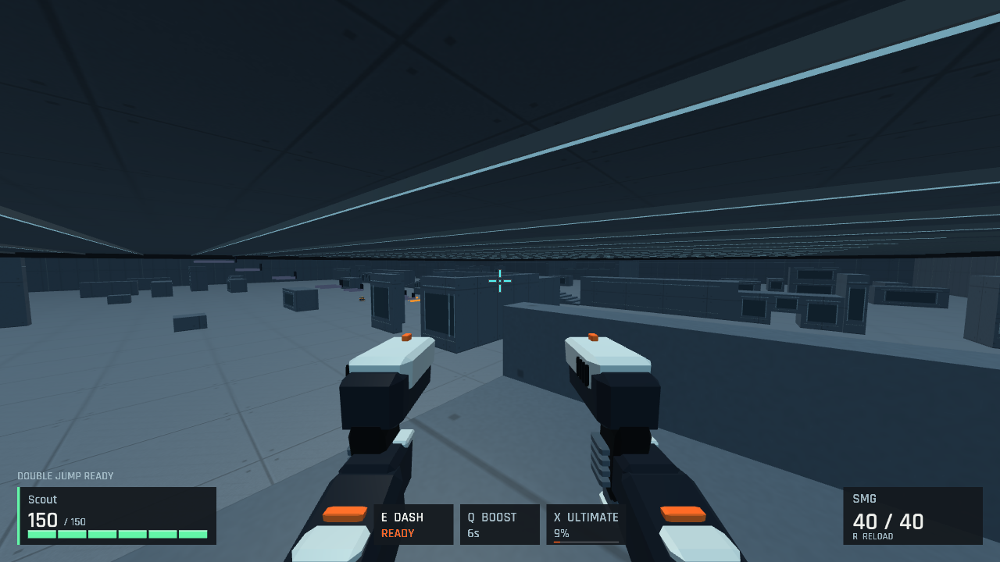
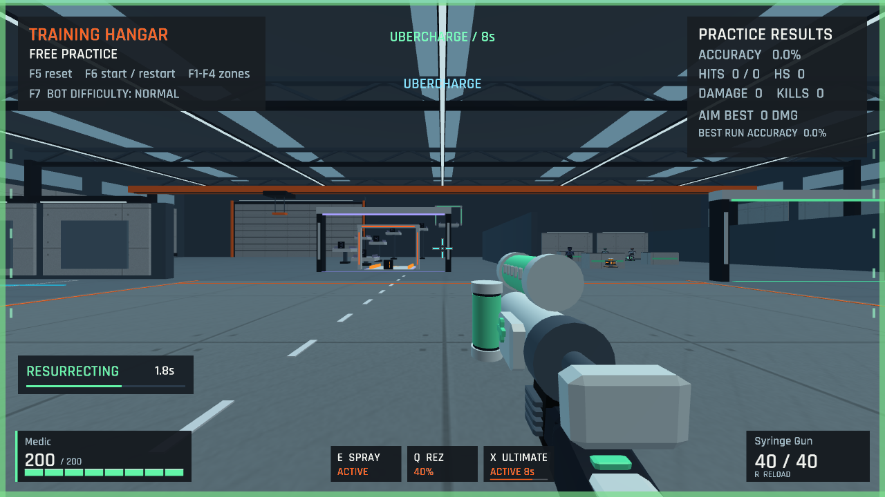

  

<h1 align="center">NeonFront</h1>

  <b>Train. Win. Repeat.</b> 
  A fast, hero-based arena shooter for Windows. Practise solo, then fight with friends over LAN.

  

  
  
  

---

## Pick your operator

Four heroes. Each one has a weapon, two abilities and an ultimate.

| Operator | Role | Weapon | E | Q | X (Ultimate) |
|---|---|---|---|---|---|
| **Assault** | Frontline / Sustain | Rifle | Healing field | Helix rocket | Tactical visor |
| **Scout** | Mobility / Flank | Dual SMGs | Dash | Speed boost | Time warp |
| **Sniper** | Precision / Range | Sniper rifle | Scope | Grappling hook | Invisibility |
| **Medic** | Support / Survival | Syringe gun | Healing spray | Resurrect / self-rez | Ubercharge |

## Fight

- **Team Deathmatch, Free-for-All and Control.** In Control, teams capture points and hold them to score.
- **Seven maps:** Dockyard 9, Foundry, Arena, Complex, Relay, Gatehouse and Reactor.
- **Dockyard 9** is the new default map. It is a neon harbour with:
  - a container yard;
  - a cargo street;
  - quay cranes;
  - a control tower.
- **Time of day.** Every map can be played at night, dusk, dawn or in daylight. Change it in **Settings**.
- **Quick melee** on **V**. The Sniper's grappling hook now anchors to any surface.
- **Server bots.** Bots fill empty slots and move around the map on their own.
- **Killcam.** See the kill replayed from your killer's point of view.
- **Minimap and pings.** Teammates always show on the minimap. Enemies you have spotted stay marked for a few seconds. Hold **G** or the middle mouse button to open the ping wheel, or double-tap it to mark an enemy.
- **Match timer.** The host sets the match length in the lobby.
- **Smooth online play.** The server keeps hits fair and the game stays smooth even with some ping.

<table>
  <tr>
    <td></td>
    <td></td>
  </tr>
  <tr>
    <td></td>
    <td></td>
  </tr>
</table>

## Train

The **Training Campus** works fully offline:

- **Aim Trainer:** 60-second precision and tracking runs, with personal bests.
- **Target Lab:** test damage and abilities on dummies.
- **Bot Arena:** fight three live bots, with adjustable difficulty.
- **Movement Course:** eight timed checkpoints of sprinting and jumping.

## Play

1. Download **[NeonFront-Launcher.exe](../../releases/latest/download/NeonFront-Launcher.exe)**.
2. Run it. The launcher installs the game to `%LOCALAPPDATA%\NeonFront` and keeps both itself and the game up to date. Then press **PLAY**.
3. To play with friends, one player runs `neonfront_server.exe` from the game folder. It uses port **7777**. Everyone then enters that player's address under **Multiplayer**, creates or joins a lobby, and readies up.

The other release files (`manifest.json` and `NeonFront-<version>-win64.zip`) are for the launcher. You don't need to download them.

### Default controls

| Key | Action |
|---|---|
| W A S D | Move |
| Shift | Sprint |
| Space | Jump |
| Ctrl | Crouch |
| Left mouse | Fire |
| V | Quick melee |
| R | Reload |
| E / Q | Abilities |
| X | Ultimate |
| G / Middle mouse | Ping |
| Tab | Scoreboard |
| Esc | Pause menu |

You can rebind every key in **Settings → Keybinds**.

---

  This repository only hosts releases. © NeonFront, all rights reserved. See <a href="LICENSE">LICENSE</a>.

